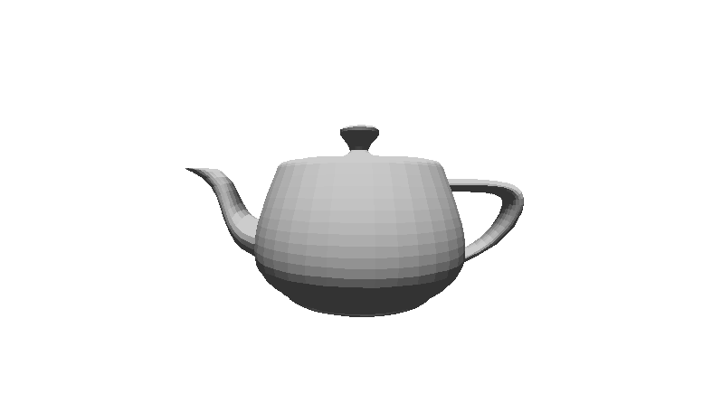
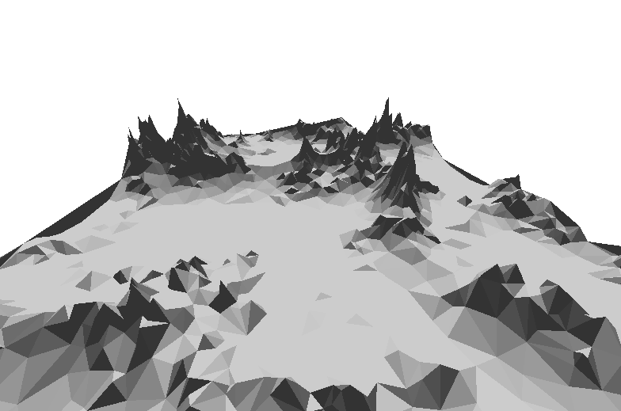

# Project Title: 3D Graphics Engine

This project is an implementation of a 3D Graphics Engine, originally developed by Javidx9 on YouTube. The original version was designed to work in the console, but this version has been adapted to use OpenGL, a powerful cross-platform graphics API.

## Features

* **Adapted from Console to OpenGL** : This project has been adapted from a console-based application to use OpenGL. This allows for more powerful and efficient rendering of 3D graphics.
* **File Loading** : The `olcEngine3D` class constructor also takes a filename as a parameter, allowing for 3D models to be loaded from files.
* **4x4 View Matrix and Camera Implementation** : The engine uses a 4x4 matrix for transformations and camera implementation. This allows for complex transformations and camera movements, including panning and pitch/yaw adjustments.
* **Keyboard and Mouse Controls** : The engine supports keyboard inputs for panning and mouse inputs for pitch/yaw adjustments. This allows for a more interactive and immersive user experience.
* **Triangle Clipping** : The engine includes functionality for triangle clipping. This is a crucial feature for any 3D engine, as it ensures that only the visible parts of an object are rendered, improving performance and visual accuracy.

## Screenshots

## Compilation

The project uses a Makefile for compilation. To compile the project, use the following command:

**make**

To build from scratch run

**make clean**

**make**

This command will compile the necessary files and link the necessary libraries according to the rules defined in the Makefile.

## License

This project is licensed under the MIT License.
